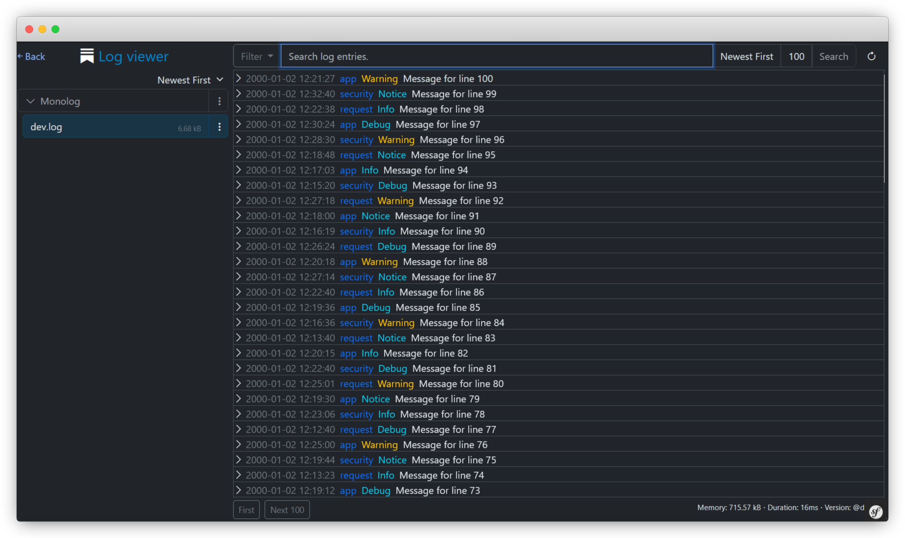

[](LICENSE)
[](https://php.net/)
[](https://symfony.com/releases)
[](https://vuejs.org/)
[](https://app.codecov.io/gh/frankdekker/symfony-log-viewer-bundle)


<div style="text-align: center">
<h1 style="margin-bottom:0">Log viewer for Symfony</h1>
<i>Inspired by <a href="https://github.com/opcodesio/log-viewer">opcodesio/log-viewer</a> for Laravel</i>

</div>

 **Log Viewer**: a bundle for your [Symfony](https://symfony.com/) app. It provides a user-friendly UI to read, filter and search log files.

Out of the box it will read your Monolog logs in the `var/log` directory, but can be configured to
read logs from any directory.


### Features

- 📂 View all the **Monolog logs** in the `%kernel.logs_dir%` directory,
- 📂 **View other types of logs** - Apache, Nginx, or custom logs,
- 🔍 **Search** the logs,
- 🔍 **Filter** by log level (error, info, debug, etc.), by channel, date range or log content inclusion or exclusion,
- 🔍 **Search** multiple log files at once,
- 🌑 **Dark mode**,
- 🕑 **Present log entries in your local timezone**,
- 🖥️ **Multiple host** support,
- 💾 **Download** or **delete** log files from the UI,
- ☎️ **API access** for folders, files & log entries,

## Getting started

### Requirements

- **PHP 8.1+**
- **Symfony 6.0+ or 7.0+**

### Installation

Use [composer](https://getcomposer.org/).
```bash
composer require fdekker/log-viewer-bundle
```
If you don't use Symfony Flex, you'll need to manually enable the bundle:

```php
# /config/bundles.php
return [
    // ...
    FD\LogViewer\FDLogViewerBundle::class => ['all' => true],
];
```
And add the route by creating file `/config/routes/fd_log_viewer.php`:
```php
<?php
use Symfony\Component\Routing\Loader\Configurator\RoutingConfigurator;

return static function (RoutingConfigurator $routingConfigurator): void {
    $routingConfigurator->import('.', 'fd_symfony_log_viewer')->prefix('/log-viewer');
};
```
<span style="color:yellow">⚠</span> Ensure access to your logs are secure by adding the line below to `/config/packages/security.php`:
```php
return static function (SecurityConfig $security): void {
    ...
    $security->accessControl()->path('^/log-viewer')->roles(['ROLE_ADMIN']);
};
```

After installing the package, publish the front-end assets by running:
```bash
php bin/console assets:install
```

### Usage

Once the installation is complete, you will be able to access **Log Viewer** directly in your browser.

By default, it is available at: `/log-viewer` on your domain.

## Configuration
Default configuration: [(Configuration reference)](https://github.com/frankdekker/symfony-log-viewer-bundle/blob/master/docs/configuration-reference.md)
```yaml
fd_log_viewer:
    home_route: null

    log_files:
        monolog:
            type: monolog
            name: Monolog
            finder:
                in: "%kernel.logs_dir%"
                name: "*.log"
                depth: '== 0'
                ignoreUnreadableDirs: true
                followLinks: false
            downloadable: false
            deletable: false
            start_of_line_pattern: '/^\[\d{4}-\d{2}-\d{2}[^]]*]\s+\S+\.\S+:/'
            log_message_pattern: '/^\[(?P<date>[^\]]+)\]\s+(?P<channel>[^\.]+)\.(?P<severity>[^:]+):\s+(?P<message>.*)\s+(?P<context>[[{].*?[\]}])\s+(?P<extra>[[{].*?[\]}])\s+$/s'
            date_format: null

    hosts:
        localhost:
            name: Local
            host: null
```

Read more:
- [Adding more monolog directories](https://github.com/frankdekker/symfony-log-viewer-bundle/blob/master/docs/adding-more-monolog-directories.md)
- [Modifying monolog configuration](https://github.com/frankdekker/symfony-log-viewer-bundle/blob/master/docs/modifying-monolog-configuration.md)
- [Disabling the default monolog configuration](https://github.com/frankdekker/symfony-log-viewer-bundle/blob/master/docs/disabling-default-monolog-configuration.md)
- [Adding additional log files](https://github.com/frankdekker/symfony-log-viewer-bundle/blob/master/docs/adding-additional-log-files.md)
- [Adding apache logs](https://github.com/frankdekker/symfony-log-viewer-bundle/blob/master/docs/configuring-apache-logs.md)
- [Adding nginx logs](https://github.com/frankdekker/symfony-log-viewer-bundle/blob/master/docs/configuring-nginx-logs.md)
- [Adding php error_log](https://github.com/frankdekker/symfony-log-viewer-bundle/blob/master/docs/configuring-php-error-log.md)
- [Adding remote hosts](https://github.com/frankdekker/symfony-log-viewer-bundle/blob/master/docs/adding-remote-hosts.md)
- [Configuring the back home url](https://github.com/frankdekker/symfony-log-viewer-bundle/blob/master/docs/configuring-the-back-home-route.md)
- [Advanced search queries](https://github.com/frankdekker/symfony-log-viewer-bundle/blob/master/docs/advanced-search-queries.md)
